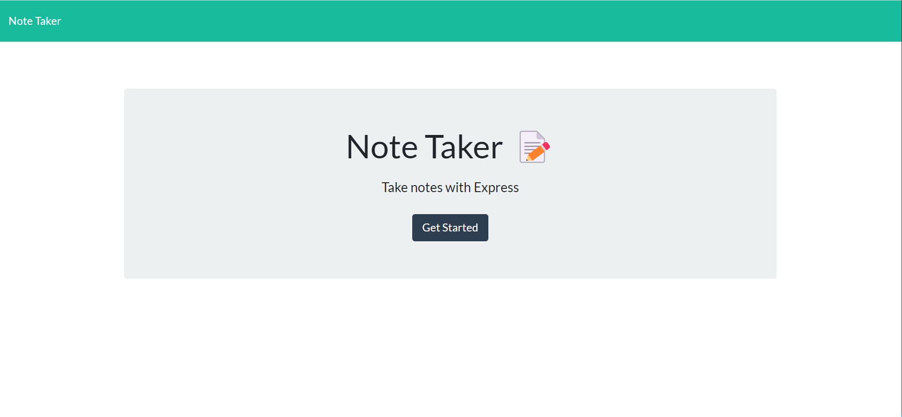
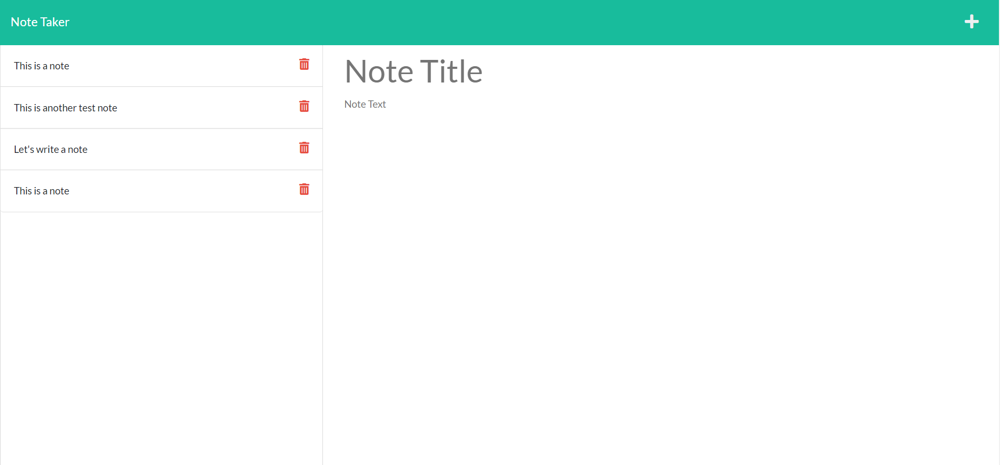
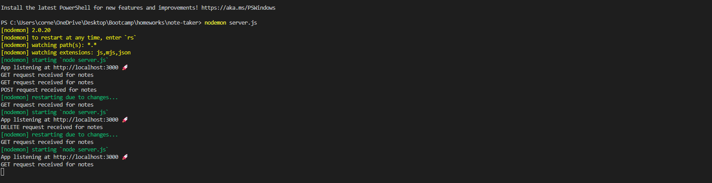

# Note Taker Application


## Description

This is an application called Note Taker that can be used to write and save notes. This application will use an Express.js back end and will save and retrieve note data from a JSON file. The following Acceptance Criteria is met:

```md
GIVEN a note-taking application
WHEN I open the Note Taker
THEN I am presented with a landing page with a link to a notes page
WHEN I click on the link to the notes page
THEN I am presented with a page with existing notes listed in the left-hand column, plus empty fields to enter a new note title and the note’s text in the right-hand column
WHEN I enter a new note title and the note’s text
THEN a Save icon appears in the navigation at the top of the page
WHEN I click on the Save icon
THEN the new note I have entered is saved and appears in the left-hand column with the other existing notes
WHEN I click on an existing note in the list in the left-hand column
THEN that note appears in the right-hand column
WHEN I click on the Write icon in the navigation at the top of the page
THEN I am presented with empty fields to enter a new note title and the note’s text in the right-hand column
```

The application landing page looks as follows:



The application add notes page looks as follows:



The application's backend looks as follows:



## Table of Contents

- [Installation](#installation)
- [Usage](#usage)
- [Credits](#credits)
- [Contribute](#contribute)
- [Tests](#tests)
- [Questions](#questions)
- [License](#license)

## Installation

No packages need to be installed in order to run this application.

The application is run using node.js:

https://nodejs.org/en/ 

## Usage

This program can be downloaded and used by anyone. To run the application, use the following node command:

```md
node server.js
```

## Credits

This application was made as an exercise in creating back-end/server functionality and therefore the front-end was provided by the UW bootcamp.

## Contribute

This is a completed application and does not need any contributions.

## Tests

There is no testing associated with this application. 

## Questions

Feel free to reach out to me with questions:

Find my GitHub at: [GitHub Profile](https://github.com/cornetj13)

Email me at: cornetj2@gmail.com

## License

This source code is licensed under the MIT license found in the LICENSE file in the root directory of this source tree.